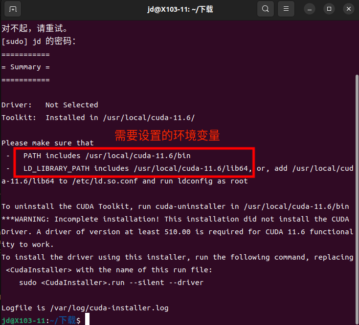
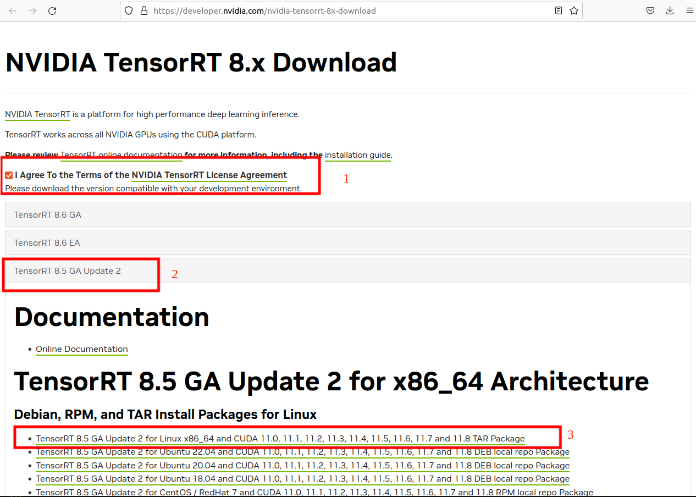
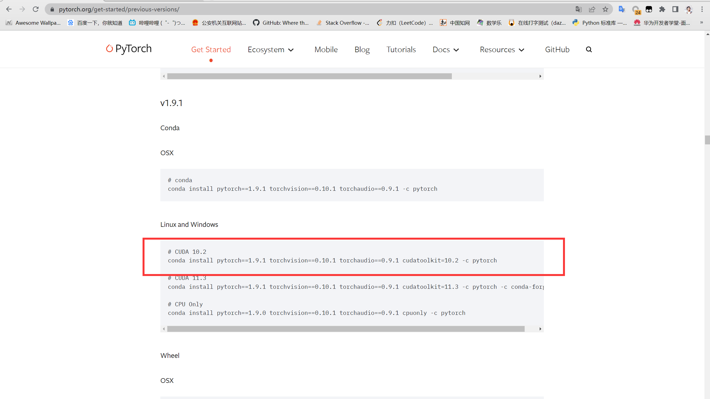

# 人工智能环境配置-Ubuntu22.04

1. 安装CUDA
2. 安装CUDNN
3. 安装CMake
4. 安装opencv
5. 安装tensorrt(推理加速)
6. 安装anacoda(pytorch环境)
7. 安装labelimg(图片标注)
8. 下载yolov5项目(模型训练)
9. 下载tensorrtx项目(模型转换)

## 1.安装cuda

1. 查看显卡驱动信息

     `nvidia-smi`
     
     CUDA Version显示本驱动可用的最高cuda版本

     下载对应cuda版本的cuda https://developer.nvidia.com/cuda-toolkit-archive

2. 运行cuda安装程序
     `sudo sh cuda_11.6.2_510.47.03_linux.run`

     选择Continue

     

     输入accept

     

     取消第一个选项，然后回车install

     

     安装成功会显示需要设置的环境变量

     


3. 设置环境变量

     输入命令
     `sudo gedit ~/.bashrc`

     添加下面内容到文件最后

     ```shell
     export PATH=$PATH:/usr/local/cuda-11.6/bin
     export LD_LIBRARY_PATH=$LD_LIBRARY_PATH:/usr/local/cuda-11.6/lib64
     ```

     

     刷新环境变量

     `source ~/.bashrc`

4. 验证安装是否成功

     `nvcc -V`

     


## 2.安装cudnn

1. 下载cudnn https://developer.nvidia.com/rdp/cudnn-archive

2. 解压 xxx为下载的版本号

     `tar -xvf cudnn-linux-x86_64-8.x.x.x_cudaX.Y-archive.tar.xz`

3. 安装
     ```shell 
     sudo cp cudnn-*-archive/include/cudnn*.h /usr/local/cuda/include 
     sudo cp -P cudnn-*-archive/lib/libcudnn* /usr/local/cuda/lib64 
     sudo chmod a+r /usr/local/cuda/include/cudnn*.h /usr/local/cuda/lib64/libcudnn*
     ```

4. 验证安装

     `cat /usr/local/cuda/include/cudnn_version.h | grep CUDNN_MAJOR -A 2`

     

## 3.安装cmake

1. 下载cmake3.14.7.tar.gz https://cmake.org/files/v3.14/

2. 解压

     `tar -zxvf cmake-3.14.7.tar.gz`

3. 进入cmake目录

     `cd cmake-3.14.7/`

4. 验证编译

     `./bootstrap`

     


5. 编译

     `make -j16`

6. 安装

     `sudo make install`

7. 验证安装

     `cmake --version`

     

## 4.opencv

1. 下载opencv4.7 https://opencv.org/releases/

     

2. 解压并进入opencv目录

     `unzip opencv-4.7.0.zip`

     `cd opencv-4.7.0/`

3. 安装依赖包

     `sudo apt-get update`

     ```shell
     sudo apt install build-essential cmake git pkg-config libgtk-3-dev \
          libavcodec-dev libavformat-dev libswscale-dev libv4l-dev \
          libxvidcore-dev libx264-dev libjpeg-dev libpng-dev libtiff-dev \
          gfortran openexr libatlas-base-dev python3-dev python3-numpy \
          libtbb2 libtbb-dev libdc1394-25
     ```
4. 创建目录并进入目录

     `mkdir build`

     `cd build`

5. cmake编译

     `sudo cmake -DCMAKE_BUILD_TYPE=Release -DOPENCV_GENERATE_PKGCONFIG=ON -DCMAKE_INSTALL_PREFIX=/usr/local .. `

     

6. 编译

     `sudo make -j16`

7. 安装

     `sudo make install `

     打开文件,添加 `/usr/local/lib`到文件中

     `sudo gedit /etc/ld.so.conf.d/opencv4.conf `

     `sudo ldconfig`

     

     安装updatedb命令

     `sudo apt-get install mlocate`

     `sudo updatedb`

8. 验证opencv安装

     `pkg-config --modversion opencv4`

     

## 5.tensorrt

1. 下载tensorrt https://developer.nvidia.com/nvidia-tensorrt-8x-download

     

2. 解压 

     `tar -zxvf TensorRT-8.5.3.1.Linux.x86_64-gnu.cuda-11.8.cudnn8.6.tar.gz`


3. 设置环境变量，`path/to`换成解压目录的上级目录

     `sudo gedit ~/.bashrc`

     ```shell
     export LD_LIBRARY_PATH=/path/to/TensorRT-8.5.3.1/lib:$LD_LIBRARY_PATH
     export LIBRARY_PATH=/path/to/TensorRT-8.5.3.1/lib::$LIBRARY_PATH
     ```

     

     刷新环境变量

     `source ~/.bashrc`


4. 验证安装

     `cd TensorRT-8.5.3.1/samples/sampleOnnxMNIST`

     `make -j16`

     在文件夹 `TensorRT-8.5.3.1/targets/x86_64-linux-gnu/bin`下会有生成的可执行文件sample_onnx_mnist

     进入文件夹并运行该可执行文件

     `./sample_onnx_mnist`

     显示下图则安装成功

     

## 6.anaconda

1. 下载anaconda3 https://www.anaconda.com/download

     

2. 安装

     `sh ./Anaconda3-2023.03-Linux-x86_64.sh`

     - 查看许可，输入回车
     - 空格，空格，空格...
     - 接受许可，输入yes      
     - 安装位置，默认即可，输入回车
     - 是否初始化终端？输入yes
     - 重启终端

3. 创建虚拟环境

     `conda create -n pytorch python=3.9`

     - 输入y确认安装

4. 进入虚拟环境

     `conda activate pytorch`

5. 安装pytorch1.9.1，pytorch官网 https://pytorch.org/get-started/previous-versions/

     

     `conda install pytorch==1.9.1 torchvision==0.10.1 torchaudio==0.9.1 cudatoolkit=10.2 -c pytorch
`

     - 输入y确认安装

## 7.安装labelImg

### 7.1pip换源

1. 家目录创建.pip目录

     `mkdir ~/.pip`

2. 创建pip配置文件
     
     `touch ~/.pip/pip.conf`

3. 打开pip配置文件

     `gedit ~/.pip/pip.conf`

4. 添加以下内容

     ```shell
     [global]
     timeout = 6000
     index-url = http://mirrors.aliyun.com/pypi/simple
     [install]
     trusted-host=mirrors.aliyun.com

     ```

### 7.2安装labelImg依赖包

1. 进入pytorch环境

     `conda activate pytorch`

2. 安装labelImg依赖包

     1. `pip install pyqt5`

     2. `pip install pyqt5-tools`

     3. `pip install lxml`

     4. `sudo apt install libxcb-xinerama0`

     5. `pip install labelimg`

### 7.3验证安装

1. labelImg注意**Img的I的大写**

     `labelImg`


## 8.yolov5项目(训练模型)

1. 克隆yolov5-5.0

     `git clone -b v5.0 https://github.com/ultralytics/yolov5.git`

2. 进入目录

     `cd yolov5`

3. 切换环境

     `conda activate pytorch`

4. 安装依赖

     `pip install -r ./requirements.txt`

5. 防止训练时可能会出现的问题

     `pip uninstall setuptools`

     `pip install setuptools==56.1.0`

     `pip uninstall numpy`

     `pip install numpy==1.23`

### 训练自己的模型

1. 在data目录下创建项目目录

     

     cat-dog为项目名称，images用来存放图片，labels用来存放标签

2. 在data目录下创建.yaml文件

     ```yaml
     # 将train和val改为自己项目中图片的路径
     train: /home/lxy/Documents/yolov5/data/traffic/images/train
     val: /home/lxy/Documents/yolov5/data/traffic/images/val

     # 类别个数
     nc: 5

     # 类别名称列表
     names: ['limit_50','limit_10','green_light','yellow_light','red_light']
     ```

3. 回到yolov5目录修改models目录下的yolov5s.yaml文件

     

     将nc改为你自己的类型个数

4. 开始训练

     - 切换到pytorch环境`conda activate pytorch`
     `python train.py --batch-size 16 --epochs 1000 --cfg ./models/yolov5s.yaml --data ./data/你创建的yaml文件`
     - --batch-size 越大显存要求就越大，按计算机性能定
     - --epochs 训练的轮数
     - --cfg 要用到的模型配置文件
     - --data 要用到的数据文件
     
     训练结果存放在yolov5目录下的runs/train目录中
     best.pt为最好的模型，last.pt为最后训练的模型

5. 模型的预测

     - `python detect.py --weights 你训练的模型.pt --source 图片路径或图片目录路径、视频路径、0为摄像头`
     - 预测结果在yolov5目录下runs/detect目录中


## 9.Tensorrtx项目(推理加速)

1. 克隆Tensorrtx-yolov5-v5.0 

     `git clone -b yolov5-v5.0 https://github.com/wang-xinyu/tensorrtx.git`

     进入目录

     `cd tensorrtx-yolov5-v5.0/yolov5/`


2. 转换为wts文件

     - 复制`gen_wts.py`到yolov5目录下
     - 切换到pytorch环境`conda activate pytorch`
     - 进行转换`python gen_wts.py -w ./weights/best.pt -o best.wts`
     - 将转换好的wts文件复制到tensorrtx/yolov5目录下

3. 修改CMakeLists.txt文件

     
     修改tensorrt为自己的安装位置


4. 修改`yololayer.h`文件


     

     static constexpr int CLASS_NUM = 80;将80改成自己的类别数目


5. 编译

     `mkdir build`

     `cd build`

     `make -j16`

6. 转换成engine格式

     `./yolov5 -s ../best.wts ./best.engine s`

7. 使用engine模型预测

     - 将上级目录下的yolov3-sp中samples文件夹复制到yolov5目录

     `./yolov5 -d best.engine ../samples`


